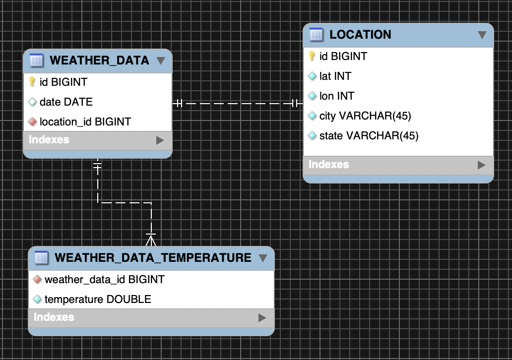

Tú y tu buena amiga se han propuesto construir una primera versión de un servicio meteorológico en no más de 3 horas. 
Para ello consideran exponer un API REST utilizando Spring Boot. 
Para ayudarte, ella te ha dejado esta estructura inicial de un proyecto maven, con algunas dependencias importantes. 
Ha decidido utilizar Java 11, pero si lo prefieres puedes utilizar Java 8, adaptando el proyecto para ello.

Tras un análisis han considerado que un dato meteorológico presenta las siguientes características:

+ id: ID único de los datos meteorológicos.
+ date: Fecha de registro de datos meteorológicos (formato yyyy-MM-dd).
+ location: Lugar para el que se registraron los datos meteorológicos. 
El location en sí es un elemento que consta de los siguientes campos:
  - lat: Latitud de la ubicación (Máximo cuatro decimales).
  - lon: Longitud de la ubicación (Máximo cuatro decimales).
  - city: Nombre de la ciudad.
  - state: Nombre del estado.
+ temperature: Array de 4 valores flotantes (hasta un decimal), que describe la temperatura por hora (en F°) 
para la ubicación dada.

Tu amiga te deja un ejemplo de un JSON que representa un dato meteorológico:

```json
{
    "id": 37892,
    "date": "2020-09-15",
    "location": {
        "lat": 32.7767,
        "lon": 96.7970,
        "city": "Dallas",
        "state": "Texas"
    },
    "temperature": [
        89.7,
        84.3,
        91.2,
        93.1
    ]
}
```

# RESTful Endpoints
Como primeras funcionalidad básicas han propuesto construir estos endpoints:

### GET /weather 
Obtiene todos los datos meteorológicos presentes en el sistema, ordenados descendentemente por ID. 
La respuesta HTTP es 200.

### GET /weather/{weatherId}
Obtiene un dato meteorológico representado por el id provisto con una respuesta HTTP 200. 
Si no existe un registro para ese id, la respuesta contiene un HTTP 404.

### GET /weather?date={date}
Obtiene todos los datos meteorológicos que están asociados con la fecha dada con un código HTTP 200.
Si la fecha presentada no tiene datos asociados, el código de respuesta HTTP debe ser 404.

### POST /weather
Permite agregar un dato meteorológico. Si ya existen datos meteorológicos con el mismo ID, el código de respuesta deberá 
tener un código HTTP 400, de lo contrario, la respuesta deberá contener el código HTTP 201.

### DELETE /weather/{weatherId}
Permite eliminar un registro identificado con el id provisto. La respuesta al eliminar el registro debe contener un 
código HTTP 200.  
Si por el contrario el registro no existe, la respuesta debe contener un código HTTP 404.

### DELETE /weather
Permite eliminar todos los registros del sistema.  La respuesta al eliminar los registros debe contener un código HTTP 200.  

# Consideraciones adicionales

Para la versión inicial de este proyecto, ustedes han decidido que una base de datos en memoria (tipo H2) es lo indicado 
para mantener los datos iniciales y realizar pruebas de integración, por lo cual al menos 5 registros serían de utilidad 
en el proceso de codificación.

Además, tests unitarios ayudarán a que esta primera versión sea menos propensa a errores y tenga una cobertura de código 
satisfactoria.

Por solicitud de tu amiga, el servicio debe levantarse en el puerto 8081. Además, te ha dejado el diseño del modelo de 
la base de datos y las entidades correspondientes.



# Reto
+ Implementa los endpoints descritos arriba.
+ Utiliza particularidades de Java 8 o superior (Lambdas, Streams, Functionals, Time API, Collections API improvements).
+ Implementa tests para lograr una cobertura de código de al menos 80%.
+ Configura una carga inicial de datos de pruebas en una BD en memoria.
+ Maneja una separación entre modelos de dominio y entidades e implementa mapeadores correspondientes.
